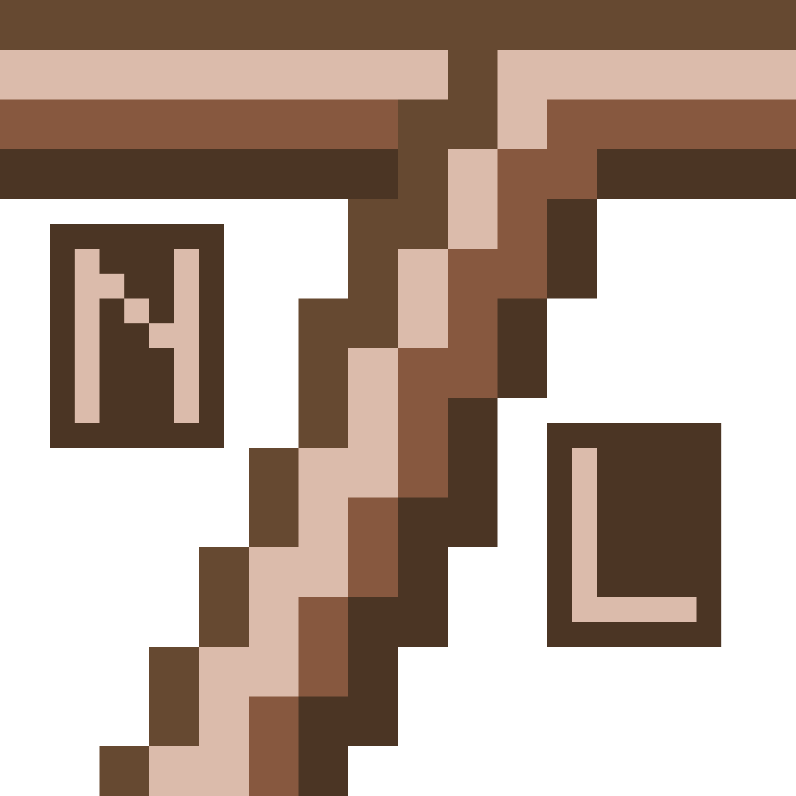
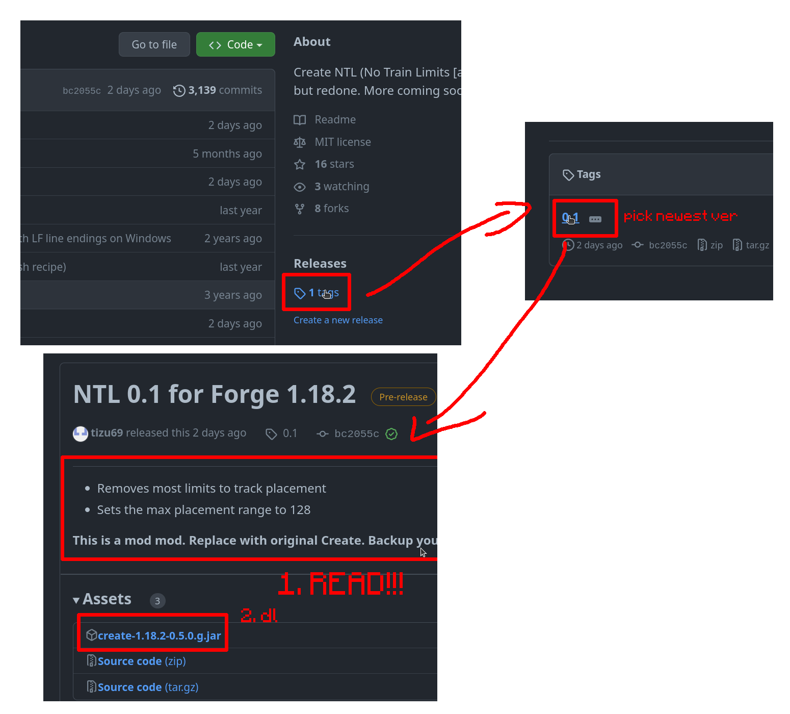

> NTL has been replaced by @rhysdh540 Create Unlimited, found [here](https://github.com/rhysdh540/create-unlimited).

<h1 align="center">Create NTL Redone </h1>

<a href="https://discord.gg/2ubhDbMaZY">Check out our Discord!</a>

<h3 align="center">Download instructions below, read tho!!</h3>

Create NTL Redone is a mod of Create (meaning that you'll have to replace this with your Create mod, but I'm also working on an addon mod).

This currently adds nothing directly, but removes some track placement limits and changes the max placement distance to 128 blocks. Make sure to get your render distance high enough tho!

<b>EXPERIMENTAL! I DO NOT FAFING CARE IF YOUR WORLD IS GONE AFTER USING THIS. BACK YOUR WORLD UP!</b>

This should work cross-compatible with normal Create, meaning that you should be able to use this to create your tracks and then just use normal Create for everything else.

<b>Want this to be ported to another version? Ask me! Click on Issues, create an issue and select "Port to version"!</b>

